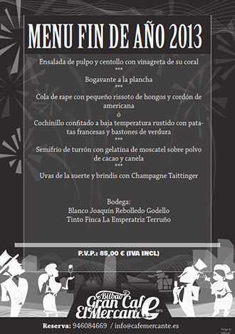
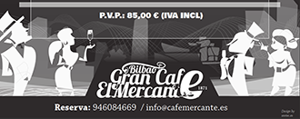
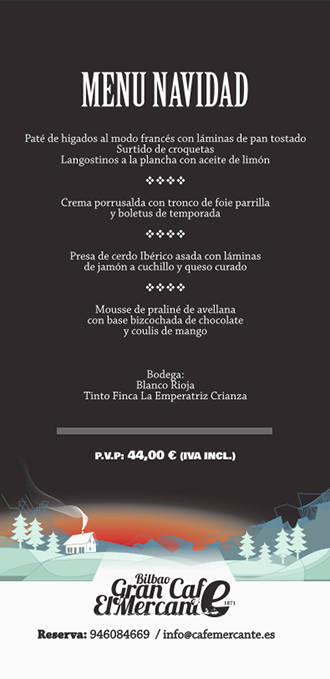

# El Especialista

Videojuego 2D de temática Zombie, que aúna géneros Shoot' em up y Runner. Se ha desarrollado a lo largo de 8 meses como trabajo de final de carrera de manera solitaria, con el motor Unity3D, obteniendo una calificación final de Sobresaliente.

He llevado a cabo todos los apartados:

- Implementación en C#
- Character Design
- Artwork y fondos
- Animación 2D
- Diseño de niveles
- Documentación técnica, estudio de viabilidad / mercado
- Análisis

	<ul>
		<li>Descargar demo en Android.</li>
    	<li>Código fuente en GitHub.</li>
	</ul>

